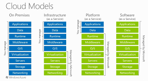

## What is CLoud Computing ?
  Cloud Computing is the delivery of computing services , including servers , storage , database , networking , software over the internet (Cloud) is called Cloud Computing .
   ## Types of Cloud Computing :
   * Public Cloud : A third-party cloud service provider owns and operates the cloud, which provides computing resources like storage and servers over the internet.
   
   * Private Cloud : A single business or organization uses the cloud computing resources exclusively.
   
   * Hybrid Cloud : A combination of public and private clouds, where data and applications can be shared between them.

   ##  Cloud Computing Models :
   

 * IAAS (Infrastructure As A Service):  

    Provides access to cloud-based infrastructure resources, such as storage, networking, and compute. Customers are responsible for the operating system, middleware, virtual machines, and apps or data. 
 
   * Examples of IaaS providers include: 
        *  AWS EC2 
        * Rackspace 
        * Google Compute Engine (GCE) 
        * Digital Ocean 
        * Microsoft Azure 
* PAAS (Platform As A Service) :

     Provides access to a cloud-hosted platform for developing, running, maintaining, and managing applications. Customers are responsible for writing code and managing data and applications.

    -  PAAS is high expensive than IAAS
    - Eg : RDS 

* SAAS (Software As A Service) :
        
    Provides access to ready-to-use, cloud-hosted application software. SaaS products are entirely managed by the vendor.

    - Examples of SaaS include email, calendaring, and office tools. 
    

## Cloud Computing Tools :
There are many tools using in the IT market on those the following are some popular tools :
   
 - Amazon Web Services (AWS)
- Microsoft Azure
 - Google Cloud Platform (GCP)
- Oracle Cloud
- IBM Cloud

## AWS (Amazon Web Services) :

* AWS stands for Amazon Web Services, a cloud computing platform that offers a variety of services for businesses, developers, and government agencies
* It is provided by Amazon Company.

## AWS History :
* 2000  - AWS began its journey in the early 2000s 

* 2003 - In 2003, Amazon get an idea of offering “Amazon’s Web Services” to the public, allowing other companies to use Amazon’s infrastructure to build and run their own applications. 

* 2006 - In 2006, AWS officially launched its first two services: Amazon S3 (Simple Storage Service)  and Amazon EC2 (Elastic Compute Cloud)

* (2006-2010) - The launch of Amazon S3 and EC2 was met with Success , Over the next few years, AWS introduced services for databases (Amazon RDS), content delivery (Amazon CloudFront), and security (AWS IAM).

* 2010 - By 2010, AWS had already established itself as a major player in cloud computing.

 ## How AWS Works?
 * AWS comes up with its own network infrastructure on establishing the datacenters in different regions mostly all over the world. 
 * Its global Infrastructure acts as a backbone for operations and services provided by AWS.
 * It facilitates the users on creating secure environments using Amazon VPCs ( Virtual Private Clouds ). Essential services like Amazon EC2 and Amazon S3 for utilizing the compute and storage service with elastic scaling.

 ## Top AWS Services
 AWS  offers a variety of services for businesses, developers, and government agencies. The following top AWS services that are in wide usage:
* Amazon EC2 (Elastic Compute Cloud)
* Amazon S3 (Simple Storage Service )
* Amazon RDS (Relational Database Service)
* Amazon VPC (Virtual Private Cloud)
* Amazon IAM (Security)

