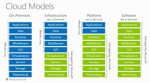

## `What is Cloud Computing ?`
  Cloud Computing is the delivery of computing services , including servers , storage , database , networking , software over the internet (Cloud) is called Cloud Computing .
   ## `Types of Cloud Computing :`
   * `Public Cloud :` A third-party cloud service provider owns and operates the cloud, which provides computing resources like storage and servers over the internet.
   
   * `Private Cloud :` A single business or organization uses the cloud computing resources exclusively.
   
   * `Hybrid Cloud :` A combination of public and private clouds, where data and applications can be shared between them.

   ##  `Cloud Computing Models :`
   

 * `IAAS (Infrastructure As A Service): ` 

    Provides access to cloud-based infrastructure resources, such as storage, networking, and compute. Customers are responsible for the operating system, middleware, virtual machines, and apps or data. 
 
   * Examples of IaaS providers include: 
        *  AWS EC2 
        * Rackspace 
        * Google Compute Engine (GCE) 
        * Digital Ocean 
        * Microsoft Azure 
* `PAAS (Platform As A Service) :`

     Provides access to a cloud-hosted platform for developing, running, maintaining, and managing applications. Customers are responsible for writing code and managing data and applications.

    -  PAAS is high expensive than IAAS
    - Eg : RDS 

* `SAAS (Software As A Service) :`
        
    Provides access to ready-to-use, cloud-hosted application software. SaaS products are entirely managed by the vendor.

    - Examples of SaaS include email, calendaring, and office tools. 

     

 ## `Virtualization :`

  Virtualization is technology that you can use to create virtual representations of servers, storage, networks, and other physical machines.

  ## `Hypervisor :`

  A hypervisor is a software that allows multiple virtual machines (VMs) to run on a single physical server by sharing the server's resources.

  ## `Cloud Computing Tools :`
There are many tools using in the IT market on those the following are some popular tools :
   
 - Amazon Web Services (AWS)
- Microsoft Azure
 - Google Cloud Platform (GCP)
- Oracle Cloud
- IBM Cloud

